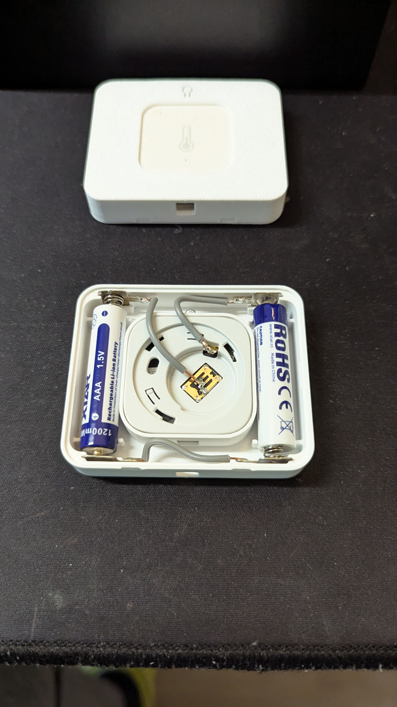
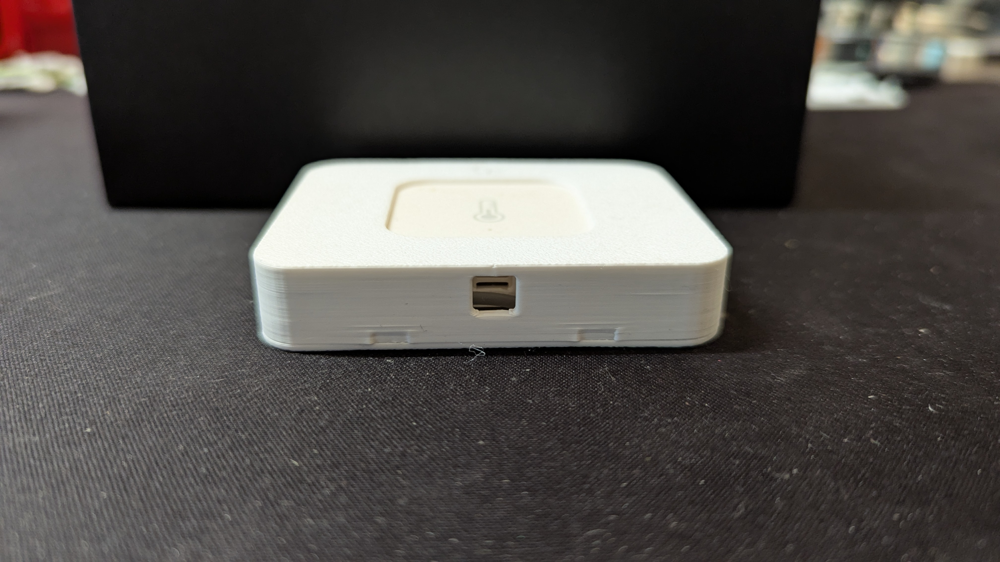

# aqara_temp_AAA_3D_shell
3D model for Aqara temperature sensor housing for 2AAA batteries

this model builds upon https://www.printables.com/model/1182992-aqara-temperature-sensor-aaa-battery-case-with-met
This version is built in FreeCAD 1.0, and I use parameters for most (not sure if all) dimensions. As such, it is relatively easy to adjust the housing for a different sensor.

